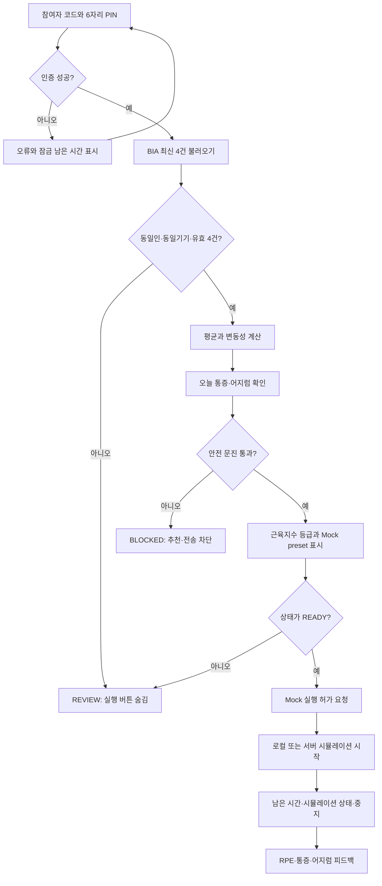
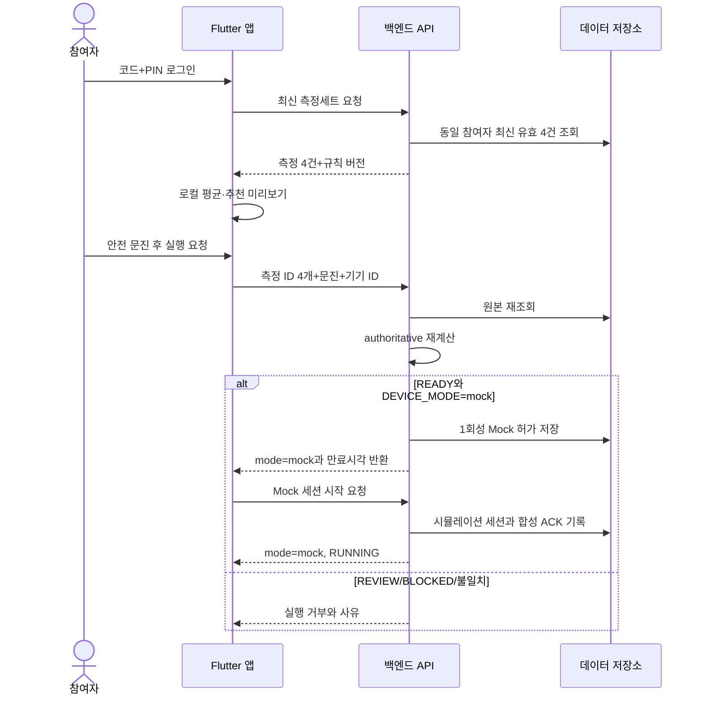
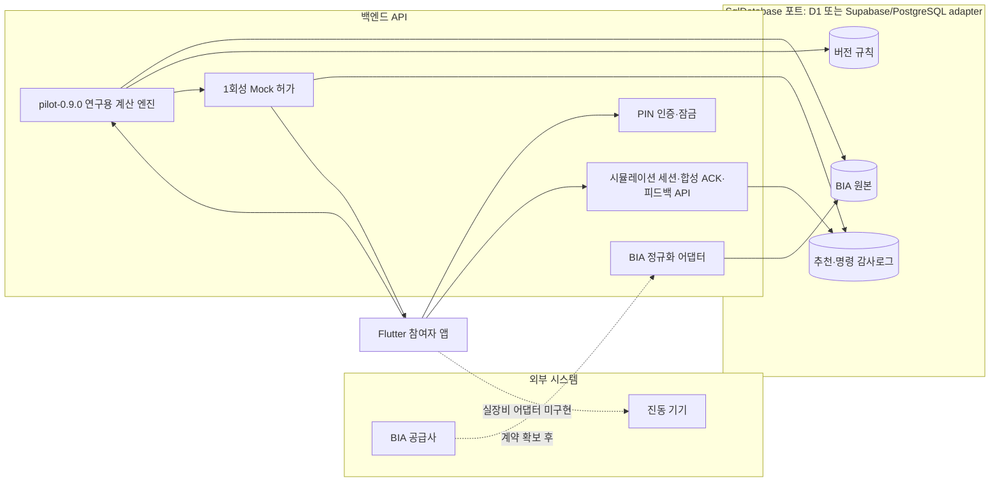
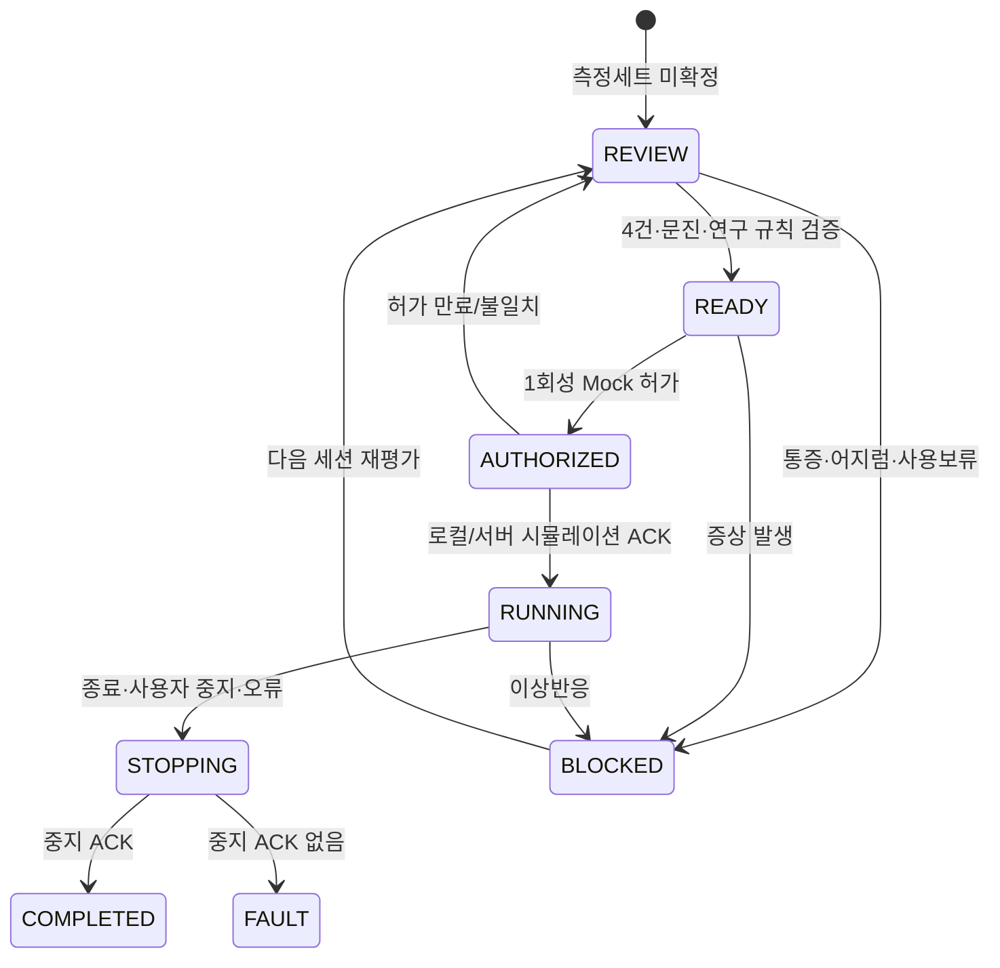

# VibeCare 유스케이스와 시스템 설계

> **Owner:** 시스템 설계 담당 · **Approver:** 앱·백엔드·장치 경계 담당
>
> **Update trigger:** 구성요소 책임, 데이터 흐름, 상태 전이 또는 외부 시스템 경계가 바뀔 때
>
> **Must not contain:** 새 제품 요구사항, 완료 선언, 확인되지 않은 외부 계약

## 참여자 유스케이스

## 현재 구현된 앱·백엔드 Mock 흐름

`VIBECARE_API_BASE_URL`이 없으면 앱 내부 Mock 저장소와 `MockDeviceGateway`를 사용한다. URL이 있으면 백엔드에 저장된 표준 측정값을 읽고 `BackendDeviceGateway`가 서버 시뮬레이터를 호출한다. 두 경로 모두 실제 진동 장치에는 연결되지 않는다.

FITRUS 프록시의 URL·인증 경계는 준비되어 있지만 공급사 성공 응답 계약과 정규화가 미완료다. 실제 REST/BLE 기기 어댑터도 없다. 두 외부 연동은 현재 흐름이 아니라 후속 작업이다.

`pilot-0.9.0`은 검증된 BIA 이력 중 최신 API 골격근량을 키²로 정규화해 등급화하고, 선택한 6개 부위에 확정 시간·Hz·강도를 추가 보정 없이 적용한다. 실제 장치 실행은 금지한다.

## 백엔드 경계

## 안전 상태 머신

현재 `DeviceGateway` 구현은 앱 내부 `MockDeviceGateway`와 서버 시뮬레이터를 호출하는 `BackendDeviceGateway`다. 어느 쪽도 물리 장치와 통신하지 않는다. REST/BLE 실장비 구현은 장치 명세·교정표·안전 승인을 확보한 뒤 같은 인터페이스 뒤에 별도 어댑터로 추가한다.

Flutter 화면은 로그인 후 `프로필·주의사항 → 골격근량 결과·직전 기록 비교 → 인체 부위·고정 설정 확인`의 로컬 표시 단계로 이동한다. 표시 단계는 서버 상태를 변경하지 않는다. 마지막 단계에서만 기존 `DeviceGateway.authorize`를 호출한다. 근육지수 등급과 부위별 고정값은 `pilot-0.9.0` 공통 알고리즘 결과를 정본으로 사용한다.

## 상태 어휘와 책임

| 범위 | 대표 상태 | 책임 |
|---|---|---|
| UI 추천 | `SIMULATION_READY`, `REVIEW`, `BLOCKED` | 입력과 안전 문진 결과를 표시한다. 준비 상태도 Mock 시뮬레이션 자격일 뿐이다. |
| 연구 실행 검토 | `CALIBRATION_REQUIRED`, `INSUFFICIENT_DATA` | 물리 실행을 막는 근거·교정·데이터 부족을 기록한다. |
| 장치 세션 | 연결, 허가, 전송, ACK 대기, 실행, 중지, 완료, 오류 | 현재는 Mock 또는 서버 시뮬레이션 수명주기만 관리한다. |

문헌의 `HOLD` 개념은 앱 추천 상태의 `BLOCKED`에 대응하지만 공개 API 상태값으로 혼용하지 않는다.
