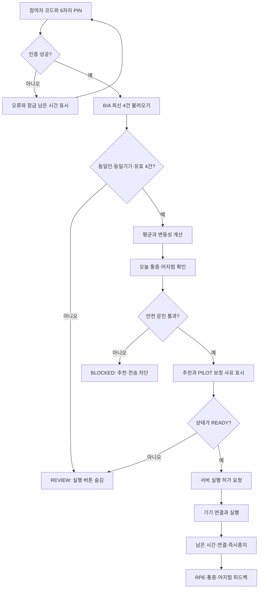
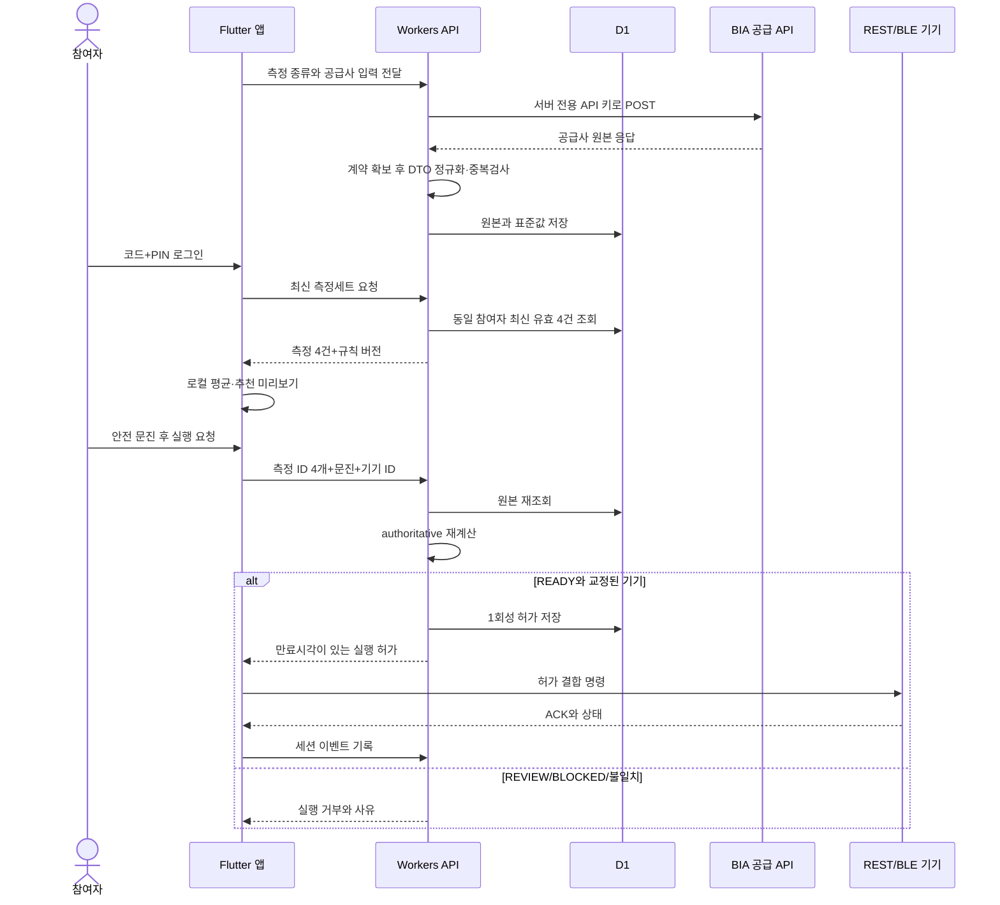
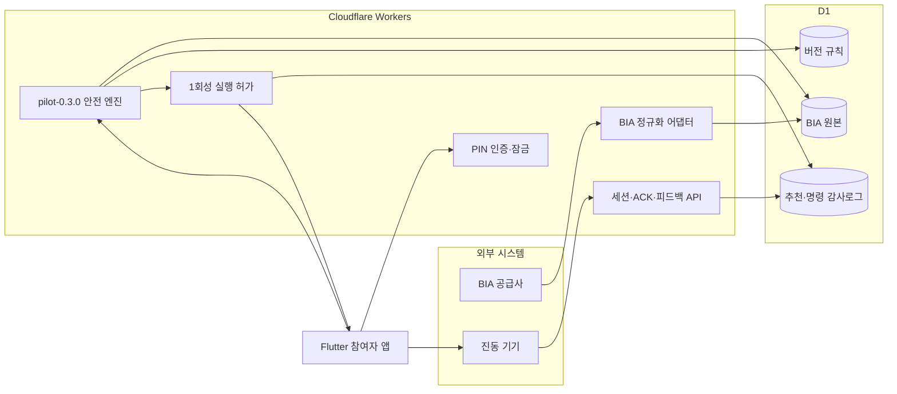
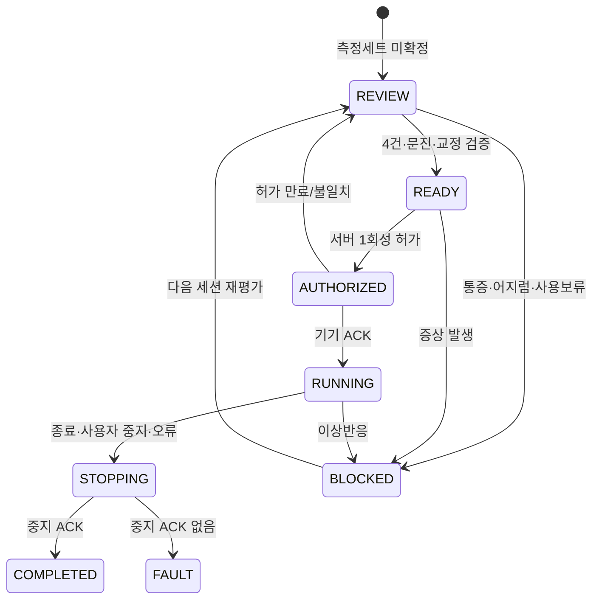

# VibeCare 유스케이스와 시스템 설계

## 참여자 유스케이스

## 앱·백엔드·기기 흐름

## 백엔드 경계

## 안전 상태 머신

실제 장비 명세 전에는 `MockDeviceGateway`만 선택된다. REST/BLE 구현은 공통 `DeviceGateway` 경계 뒤에 두므로 화면과 알고리즘을 다시 만들지 않고 공급사 어댑터만 교체할 수 있다.
