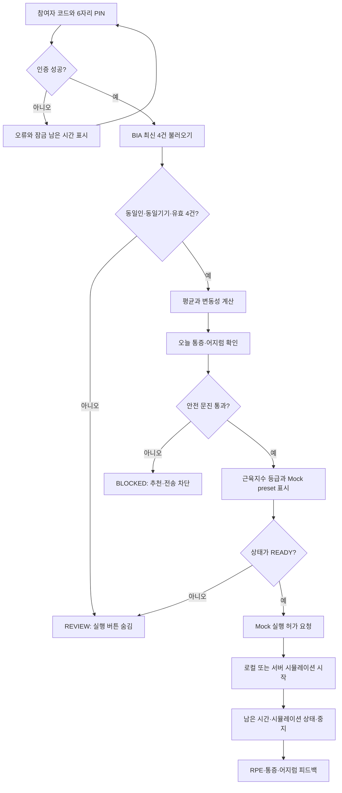
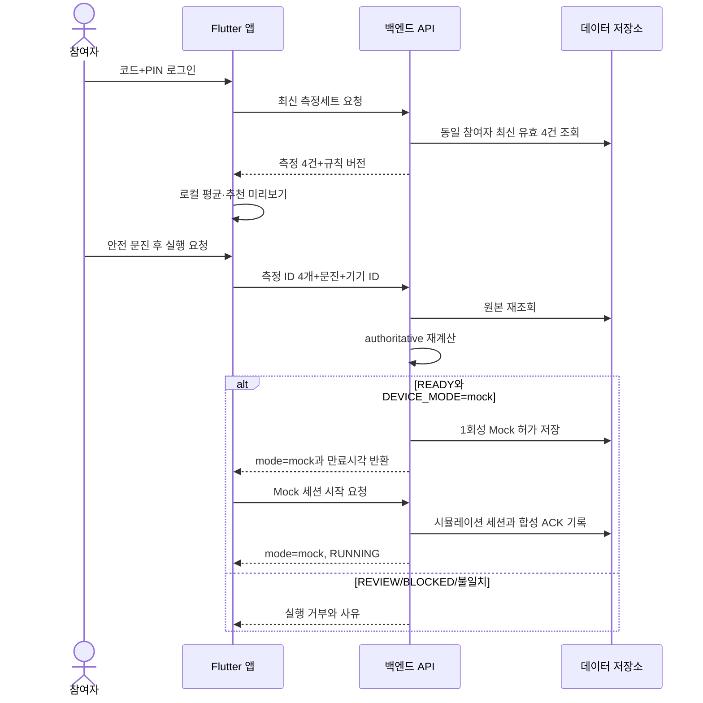
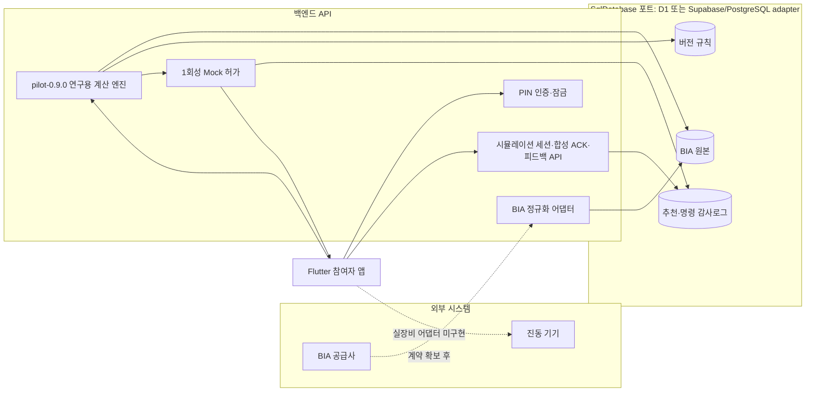
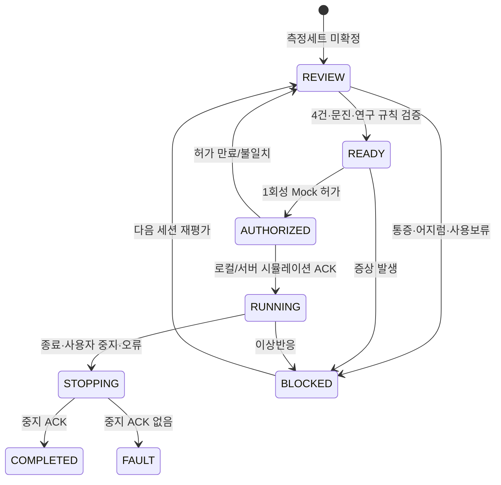

# VibeCare 유스케이스와 시스템 설계

## 현재 규칙: `pilot-0.9.1` (2026-10-04)

Flutter Mock 규칙과 Backend API의 새 활성 규칙은 [연구용 계수 설계](algorithm/pilot-0.9.1-design.md)를 따른다. 성별·70세 이상·체지방 범위 이탈 시 각각 0.95를 곱해 시뮬레이터 강도만 낮춘다. 아래 `pilot-0.9.0` 설명은 이전 규칙의 기록이다. 실제 장치 실행은 계속 금지한다.

> **Owner:** 시스템 설계 담당 · **Approver:** 앱·백엔드·장치 경계 담당
>
> **Update trigger:** 구성요소 책임, 데이터 흐름, 상태 전이 또는 외부 시스템 경계가 바뀔 때
>
> **Must not contain:** 새 제품 요구사항, 완료 선언, 확인되지 않은 외부 계약

## 참여자 유스케이스

```mermaid
flowchart TD
    A[참여자 코드와 6자리 PIN] --> B{인증 성공?}
    B -- 아니오 --> C[오류와 잠금 남은 시간 표시]
    C --> A
    B -- 예 --> D[BIA 최신 4건 불러오기]
    D --> E{동일인·동일기기·유효 4건?}
    E -- 아니오 --> F[REVIEW: 실행 버튼 숨김]
    E -- 예 --> G[평균과 변동성 계산]
    G --> H[오늘 통증·어지럼 확인]
    H --> I{안전 문진 통과?}
    I -- 아니오 --> J[BLOCKED: 추천·전송 차단]
    I -- 예 --> K[근육지수 등급과 Mock preset 표시]
    K --> L{상태가 READY?}
    L -- 아니오 --> F
    L -- 예 --> M[Mock 실행 허가 요청]
    M --> N[로컬 또는 서버 시뮬레이션 시작]
    N --> O[남은 시간·시뮬레이션 상태·중지]
    O --> P[RPE·통증·어지럼 피드백]
```

## 현재 구현된 앱·백엔드 Mock 흐름

`VIBECARE_SUPABASE_URL`과 공개용 키가 있으면 웹 기본 화면은 Supabase Auth와 사용자별 예약·측정 보기로 열린다. 샘플 시연 화면은 앱 내부 Mock 저장소와 `MockDeviceGateway`를 사용한다. 두 Supabase 설정이 없고 `VIBECARE_API_BASE_URL`이 있으면 기존 백엔드에 저장된 표준 측정값을 읽고 `BackendDeviceGateway`가 서버 시뮬레이터를 호출한다. 모든 경로에서 실제 진동 장치에는 연결되지 않는다.

```mermaid
sequenceDiagram
    actor User as 참여자
    participant App as Flutter 앱
    participant API as 백엔드 API
    participant DB as 데이터 저장소
    User->>App: 코드+PIN 로그인
    App->>API: 최신 측정세트 요청
    API->>DB: 동일 참여자 최신 유효 4건 조회
    API-->>App: 측정 4건+규칙 버전
    App->>App: 로컬 평균·추천 미리보기
    User->>App: 안전 문진 후 실행 요청
    App->>API: 측정 ID 4개+문진+기기 ID
    API->>DB: 원본 재조회
    API->>API: authoritative 재계산
    alt READY와 DEVICE_MODE=mock
        API->>DB: 1회성 Mock 허가 저장
        API-->>App: mode=mock과 만료시각 반환
        App->>API: Mock 세션 시작 요청
        API->>DB: 시뮬레이션 세션과 합성 ACK 기록
        API-->>App: mode=mock, RUNNING
    else REVIEW/BLOCKED/불일치
        API-->>App: 실행 거부와 사유
    end
```

FITRUS 서버 프록시·요청/응답 fixture·체성분/활력 정규화와 저장 경로는 구현돼 있다. 실장치 응답, 근육 정의·방법·단위의 공급사 근거, 호출 제한과 실제 endpoint 검증은 후속 작업이다. REST/BLE 물리 장치 어댑터는 없다.

`pilot-0.9.0`은 검증된 BIA 이력 중 최신 API 골격근량을 키²로 정규화해 등급화하고, 선택한 6개 부위에 확정 시간·Hz·강도를 추가 보정 없이 적용한다. 실제 장치 실행은 금지한다.

## 백엔드 경계

```mermaid
flowchart LR
    subgraph External[외부 시스템]
        BIA[BIA 공급사]
        DEVICE[진동 기기]
    end

    subgraph Backend[백엔드 API]
        AUTH[PIN 인증·잠금]
        ADAPTER[BIA 정규화 어댑터]
        ENGINE[pilot-0.9.0 연구용 계산 엔진]
        AUTHORIZE[1회성 Mock 허가]
        SESSION[시뮬레이션 세션·합성 ACK·피드백 API]
    end

    subgraph Storage[SqlDatabase 포트: D1 또는 Supabase/PostgreSQL adapter]
        RAW[(BIA 원본)]
        RULES[(버전 규칙)]
        AUDIT[(추천·명령 감사로그)]
    end

    APP[Flutter 참여자 앱] --> AUTH
    BIA -. 계약 확보 후 .-> ADAPTER --> RAW
    APP --> ENGINE
    ENGINE --> RAW
    ENGINE --> RULES
    ENGINE --> AUTHORIZE --> AUDIT
    AUTHORIZE --> APP --> SESSION --> AUDIT
    APP -. 실장비 어댑터 미구현 .-> DEVICE
```

## 안전 상태 머신

```mermaid
stateDiagram-v2
    [*] --> REVIEW: 측정세트 미확정
    REVIEW --> READY: 4건·문진·연구 규칙 검증
    READY --> AUTHORIZED: 1회성 Mock 허가
    AUTHORIZED --> RUNNING: 로컬/서버 시뮬레이션 ACK
    AUTHORIZED --> REVIEW: 허가 만료/불일치
    RUNNING --> STOPPING: 종료·사용자 중지·오류
    STOPPING --> COMPLETED: 중지 ACK
    STOPPING --> FAULT: 중지 ACK 없음
    REVIEW --> BLOCKED: 통증·어지럼·사용보류
    READY --> BLOCKED: 증상 발생
    RUNNING --> BLOCKED: 이상반응
    BLOCKED --> REVIEW: 다음 세션 재평가
```

현재 `DeviceGateway` 구현은 앱 내부 `MockDeviceGateway`와 서버 시뮬레이터를 호출하는 `BackendDeviceGateway`다. 어느 쪽도 물리 장치와 통신하지 않는다. REST/BLE 실장비 구현은 장치 명세·교정표·안전 승인을 확보한 뒤 같은 인터페이스 뒤에 별도 어댑터로 추가한다.

Flutter 화면은 로그인 후 `프로필·주의사항 → 골격근량 결과·직전 기록 비교 → 인체 부위·고정 설정 확인`의 로컬 표시 단계로 이동한다. 표시 단계는 서버 상태를 변경하지 않는다. 마지막 단계에서만 기존 `DeviceGateway.authorize`를 호출한다. 근육지수 등급과 부위별 고정값은 `pilot-0.9.0` 공통 알고리즘 결과를 정본으로 사용한다.

위 고정값 설명은 `pilot-0.9.0`의 기준값 기록이다. 현재 `pilot-0.9.1`은 같은 부위별 기본값에 문서 상단의 연구용 계수를 적용하며 Mock 강도만 변경한다.

## 검증과 배포 경계

`quality-gates` 하나에서 백엔드 단위/SQLite 시험, 별도 PostgreSQL HTTP 시험, Flutter 검사와 debug APK, 웹 빌드를 같은 커밋으로 실행한다. PostgreSQL 시험은 격리된 로컬 시험 DB의 실제 migration/seed와 Node 진입점을 사용한다. main의 모든 검사와 웹 빌드가 성공한 실행만 Pages에 배포하며 PR 실행에는 배포 권한이 없다. 실제 Supabase Auth/RLS와 운영 환경 시험은 별도로 기록한다.

## 상태 어휘와 책임

| 범위 | 대표 상태 | 책임 |
|---|---|---|
| UI 추천 | `SIMULATION_READY`, `REVIEW`, `BLOCKED` | 입력과 안전 문진 결과를 표시한다. 준비 상태도 Mock 시뮬레이션 자격일 뿐이다. |
| 연구 실행 검토 | `CALIBRATION_REQUIRED`, `INSUFFICIENT_DATA` | 물리 실행을 막는 근거·교정·데이터 부족을 기록한다. |
| 장치 세션 | 연결, 허가, 전송, ACK 대기, 실행, 중지, 완료, 오류 | 현재는 Mock 또는 서버 시뮬레이션 수명주기만 관리한다. |

문헌의 `HOLD` 개념은 앱 추천 상태의 `BLOCKED`에 대응하지만 공개 API 상태값으로 혼용하지 않는다.
## 예약·출석 데이터 경계 (2026-10-01)

GitHub Pages는 Supabase Auth 이메일 로그인 후 `public.visit_bookings`에 사용자별 예약·출석을 저장한다. `SupabaseParticipationRepository`와 RLS 정책은 `auth.uid()`로 소유권을 확인한다. 연결된 측정 기록은 `public.account_participants`의 관리자 연결과 RLS가 적용된 `public.vibecare_measurements` 보기를 통해 읽는다. 샘플 시연 화면은 기존 Mock 저장소와 시뮬레이터를 사용한다. Android는 로컬 `AlarmManager` 알림을 예약하고 웹은 열려 있는 화면에서 타이머로 알린다. DB 연결 문자열과 서비스 키는 브라우저에 제공하지 않는다.
주간 예약은 기존 `visit_bookings`의 독립된 회차 행으로 저장한다. 클라이언트가 선택한 4·12·52주 범위의 날짜를 생성하고 중복 날짜·시간은 건너뛴다. 출석률과 별은 저장된 `checked_in_at` 및 지난 예약의 날짜를 매번 계산하므로 화면 재진입 후에도 동기화된다. 운영 공지는 `public.announcements`의 게시 상태와 기간을 RLS로 제한해 인증 사용자에게 읽기만 허용한다. 게시와 수정은 운영자가 Supabase 관리 경로에서 수행한다.

## 사용 후 피드백과 현재 안전 문진 구분 (2026-10-03)

사용 후 설문의 이전 통증 기록은 feedback-0.4.0 강도 상한과 다음 시연 전 확인 안내로 전달한다. 사용 전 SafetyCheck의 현재 통증·어지럼·전문가 보류는 별도 차단 조건이다. 백엔드에서는 이전 통증만으로 만든 보류 기록을 0013 마이그레이션으로 제한적으로 전환하고, 이전 어지럼이나 심한 시간·주파수 불편 기록은 유지한다. UI 확인은 서버 승인과 시뮬레이터 상태 검사를 우회하지 않는다.
