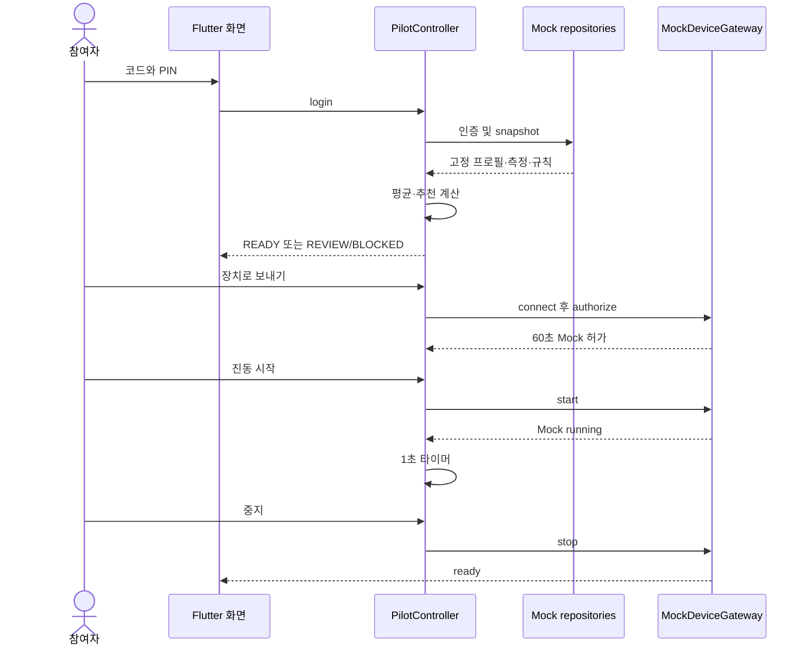

# 복원 요구사항과 사용자 흐름

FR은 `design.md`, `plan.md`, `checklist.md`, 코드의 역할을 바탕으로 복원했다. 표의 예상 동작은 수용 기준이며 현재 사실과 다를 수 있다. 구현 상태와 이번 검증 상태는 구분한다.

## 기능 수용 기준

| 요구사항 ID | 기능 | 입력 | 예상 동작 | 출력 | 예외 상황 | 현재 구현 상태 | 코드 근거 |
|---|---|---|---|---|---|---|---|
| FR-001 | 참여자 인증 | 코드·6자리 PIN | 본인 확인, 5회 실패 후15분 잠금 | 프로필·access/refresh | 오입력/잠금/설정 없음 | 부분: 서버 구현, 앱 잠금 안내 부족 | services/api/src/index.ts auth/pin; auth.ts; auth_repository.dart |
| FR-002 | 토큰 수명 | access/refresh | 만료 처리·갱신·로그아웃 | 인증 유지 또는 재로그인 | 만료/폐기/통신 오류 | 부분: 갱신 API만, 앱 자동 갱신 없음 | auth/refresh; SecureSessionStore; dioProvider |
| FR-003 | 최근 유효4건 | 본인·기기·측정 이력 | 동일인·동일기기·고유ID·품질·수치 검사 후 최신4건 | 선택ID·이력 | 4건 미만/불량/중복 | 부분: 20건 선제한, 기기 query 누락 | measurement-set/current; selectLatestValidMeasurements; WorkerFitrusRepository |
| FR-004 | 평균·일관성 | 4건·프로필 | 필수5항목 평균 및 체지방/BMI 일관성 검사 | 평균·경고 | 0/NaN/상호 불일치 | 부분: Flutter·웹과 서버 검사 다름 | 세 vibration algorithm 함수 |
| FR-005 | 명시적 안전문진 | 3문항 예/아니요 | 미응답 REVIEW, 위험 BLOCKED, 명령 불가 | 상태·이유 | 미응답/증상 있음 | 부분: 웹 게이트 있음, Flutter 미응답 없음 | SafetyDraft; SafetyCheck; _SafetySettings |
| FR-006 | 추천식 | 평균·나이·성별·규칙 | 계수 곱·20~70 clamp·BMI 검토 | 300s·20Hz·강도·버전 | BMI<18.5/비정상 | 기본 예제 구현·테스트 통과; 전체 parity 미확인 | app/lib/vibration-algorithm.ts; domain/vibration_algorithm.dart; services/api/src/algorithm.ts |
| FR-007 | 수동 하향 | 정수 강도 | 최솟값 이상·자동추천 이하만 허용 | 선택강도 | 초과·하한 미달 | 구현: UI 및 Worker 검사 | updateIntensity; applyRequestedIntensity |
| FR-008 | 서버 허가 | ID4개·문진·버전·기기·선택강도 | 최신 데이터 재계산, READY만60초 허가 | authorizationId·expiresAt | stale/버전차/범위오류 | 부분: 재계산 존재, 일관성·비활성 규칙 결함 | recommendations/authorize; ServerDeviceGateway.authorize |
| FR-009 | 세션 시작 | 허가·기기·멱등키 | 본인 허가 단일 사용, 같은 요청은 같은 세션, 기기 중복 방지 | 세션·명령·ACK | 만료/재사용/다른 사용자 | 부분: 교차 참여자 조회·별도 허가 중복 문제 | device-sessions; MockDeviceGateway.start |
| FR-010 | 중지·완료·백그라운드 | sessionId·reason | 정지 확인, 장애 시 중지 재시도 가능 | 정지·완료 상태 | 네트워크 단절/앱 종료 | 부분: 정상 Mock 통과, 실패 복구·watchdog 없음 | stopSession; onAppBackgrounded; /stop |
| FR-011 | 사후 반응 | RPE·통증·어지럼·불편 | 본인 세션 평가 저장 | saved | 잘못된 범위/타인세션 | API만 존재, 앱 미구현 | session-feedback; session_feedback |
| FR-012 | FITRUS ingest | 측정종류·공급사 payload | 원본 보관→단위 검증→canonical 저장 | BIA/vitals | 공급사 오류·스키마 불명 | 원본 프록시만 구현 | FitrusClient.measure; fitrus/measurements |
| FR-013 | 생체신호 표시 | kind·values·units | 측정시각·단위 표시, 강도식에는 미사용 | 목록 | 종류/타입 불일치 | Mock 표시·조회 코드 있음, 응답 계약 불일치 | _VitalsList; _parseVital; /vitals |
| FR-014 | 규칙 운영 | 승인 규칙·enabled·activeFrom | 승인된 활성 규칙만, 중단 시 허가 차단 | 현재 규칙·거절 | 전체 비활성/손상JSON | 부분: 승인 검증·비활성 차단 미흡 | loadRuleSet; algorithm_rule_sets |
| FR-015 | 실제 장비 제어 | 교정된 명령·장비 | 실제 ACK·중지·출력한계 확인 | 물리 출력·상태 | ACK timeout/통신 단절 | 미구현, real 모드501 | device-sessions real branch |
| FR-016 | 웹 비교/접근성 | 프로필·문진 | 즉시 수식·Mock JSON, 상태 명료 | 화면·미리보기 | 미응답/위험/좁은 화면 | 웹 구현, 이번 브라우저 상호작용 미검증 | app/page.tsx; globals.css; public/sw.js |

## 주요 흐름: Flutter Mock

[사실] 사용자는 로그인 화면의 데모 코드·PIN을 제출한다. `PilotController.login`이 MockAuthRepository에서 프로필을 받고 MemorySessionStore에 토큰을 저장한다. MockFitrusRepository가 5개 고정 측정 중 최신4개와 고정 vitals를 만든다. 도메인 함수는 결과를 반환하고 Riverpod가 화면을 갱신한다. 외부 API·D1 호출은 없다.

실패 지점은 잘못된 데모 인증·유효 측정 부족·안전 경고다. StateError는 해당 문구, 나머지 오류는 일반 재시도 안내로 표시된다. 현재 안전 값은 로그인에서 모두 false로 초기화되므로 미응답을 검출하지 못한다.

## 주요 흐름: 서버 연결

[사실] API URL이 있으면 Dio가 저장된 access token을 Authorization 헤더에 넣는다. 로그인은 Worker→D1 PIN 검증이다. 측정세트·vitals·규칙을 병렬 조회하고 모두 성공해야 snapshot이 만들어진다. 선택형 vitals API 오류도 현재 전체 로그인/새로고침을 실패시킨다.

[사실] 전송 단계에서는 `/health` 성공을 연결 완료로 간주한 뒤 `/authorize`를 호출한다. 서버가 측정·프로필·규칙을 다시 읽어 계산하고 결과·세트·허가를 D1에 저장한다. 앱은 시간·Hz·강도가 미리보기와 다르면 StateError로 차단한다. Dio의 409 등은 대부분 일반 오류 문구로 처리하며 새 규칙·최신 세트를 자동 재동기화하지 않는다.

시작은 `/device-sessions`에서 Mock ACK를 삽입하고 RUNNING을 반환한다. 정상 중지는 `/stop`으로 DB를 STOPPED로 바꾼다. 실제 기기 외부 호출은 없고 real 모드는501이다. 연결 상태 표시가 물리 연결을 입증하지 않는다.

## 주요 흐름: FITRUS

[사실] 인증된 호출자가 측정 종류와 불투명 payload를 Worker에 제출하면 allowlist의 공급사 경로로 POST한다. 성공JSON을 D1 `fitrus_raw_measurements`에 저장하고 원본을 포함한201을 돌려준다. Flutter에는 이 POST 호출부가 없다. 정규화와 canonical 테이블 INSERT 경로가 없으므로 이 API를 호출해도 추천용 데이터가 자동 추가되지 않는다.

실패: 키 없음503, 잘못된 입력400, 공급사 non-2xx/non-JSON 또는 DB 오류는 공통500. 공급사 오류 본문은 client error 객체에 보관되지만 공통 로거는 이름·메시지만 기록한다. 타임아웃·재시도는 명시되지 않는다.

## 주요 흐름: 웹

[사실] Home의 프로필 변경→useMemo 재계산→수식 표시. 문진은 null/true/false이고 모든 문항이 답변돼야 명령 생성 가능하다. 입력 변경 시 JSON 미리보기를 폐기한다. createMockCommand 결과는 화면 문자열로만 보관한다. 위험 응답 시 명령은 차단되지만 안전한 응답으로 계산한 별도 미리보기 수치가 남을 수 있고, 일부 위험 응답 후 다른 문항 미응답이면 상위 상태는 REVIEW를 우선 표시한다. 이는 design.md의 “위험 시 추천값 소멸/BLOCKED”와 차이가 있다.
