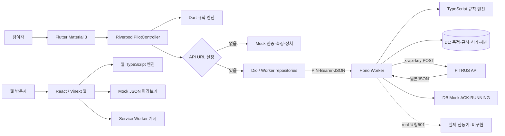

# 실제 아키텍처와 기술 선택

## 시스템 경계

[사실] 웹은 Flutter API의 프론트엔드가 아니다. `app/page.tsx`에 백엔드 호출이 없고 독립적인 고정 데이터·계산·명령 미리보기만 있다. 웹 빌드와 `backend-api/src/index.ts`의 업무 API도 별개다. `.openai/hosting.json`은 기존 웹 미리보기 설정이고 업무 백엔드의 현재 로컬 설정은 `cloudflare-local-runtime.jsonc`다. 최종 AWS 배포에는 별도 런타임과 DB 어댑터가 필요하다.

## 계층별 실제 책임

| 계층 | 구현 | 책임·한계 |
|---|---|---|
| Presentation | Flutter pilot_screen.dart / main.dart, 웹 page.tsx / globals.css | 화면, 입력, lifecycle; 화면 파일이 큰 단일 구성 |
| 상태 관리 | Riverpod Notifier PilotController/PilotState, 웹 useState/useMemo | 로그인·snapshot·추천·허가·세션·타이머; 서버 세션과 지속 동기화하지 않음 |
| Controller/API | backend-api/src/index.ts의 Hono 라우트 | 인증·검증·조회·계산·저장을 한 파일에서 수행 |
| Service/Use Case | PilotController, Worker 라우트 내부 | 독립 Worker use-case 서비스 계층 없음 |
| Domain | Flutter models/vibration_algorithm, Worker algorithm.ts, app/algorithm/vibration-algorithm.ts | 순수 계산·상태 모델; 세 구현의 검증·DTO 차이 존재 |
| Repository/Data Access | Flutter AuthRepository/FitrusRepository; Worker D1 SQL | Flutter는 인터페이스로 교체 가능. Worker는 라우트에 SQL 직접 배치 |
| 외부 연동 | Dio, FitrusClient, BackendDeviceGateway | BackendDeviceGateway는 실제 장치 어댑터가 아니라 Worker 호출기 |
| 공통 모듈 | contracts JSON Schema/OpenAPI/fixture | 참조 문서와 데이터, 런타임 코드 생성·검증에 연결되지 않음 |

## 저장·인증·운영

- [사실] D1은 12개 업무 테이블을 가진다. SQLite 관계형 키와 JSON 텍스트를 혼합한다. 모델 학습용 데이터베이스나 벡터DB는 없다.
- [사실] PIN은 PBKDF2-SHA256, 120,000회, salt와 해시로 검증한다. 토큰은 HMAC-SHA256으로 서명한 `payload.signature` 2부분 형식이며 표준 JWT 3부분 형식이 아니다.
- [사실] Flutter 서버 모드 토큰은 flutter_secure_storage에, Mock 모드는 메모리에 저장한다. 생체 데이터의 오프라인 DB는 없다.
- [사실] 전용 파일 업로드·R2 사용 코드가 없다. 원본 공급사 응답은 D1 TEXT다. 웹 캐시와 APK는 파일 저장소 기능과 별개다.
- [사실] Worker 공통 오류 로깅은 `console.error('request_failed', {name,message})`이다. 라우트별 latency·상관관계ID·경보·분산 추적 구성은 없다. command_events는 업무 이벤트 저장소이지 플랫폼 장애 모니터링 전체가 아니다.
- [사실] Android만 플랫폼 디렉터리가 추적된다. minSdk24, Java17 바이트코드, compile/target은 Flutter SDK 값 참조, 현재 기록은36이다. release도 debug 서명을 사용한다.

## 기술 스택과 선택 근거

| 기술 | 실제 위치·목적 | 선택 근거 | 장점(추론) | 제약·위험 | 대안(검토 후보) |
|---|---|---|---|---|---|
| Flutter / Material3 | main.dart, pilot_screen.dart; Android 참여자 화면 | [사실] plan.md Android 우선 단일 코드베이스 | 단일 UI·위젯 시험 | Android 외 대상 미구성, 긴 화면 파일 | Kotlin/Compose 또는 PWA 유지 |
| Riverpod 3.x | pilot_controller.dart; DI·Notifier 상태 | [사실] docs/open-source-and-evidence.md 상태/도메인 분리 | Mock 교체 용이 | 비동기 상태 전이·stop 오류 결합 | Bloc, 단순 ChangeNotifier |
| Dio 5.x | Repository와 gateway; JSON HTTP | [사실] 기존 근거 문서에 timeout·취소·인터셉터 용도 | 인증 주입 통일 | 현재 connect timeout만; refresh/receive timeout 없음 | package:http |
| flutter_secure_storage 9.2.4 | AuthSession 보관 | [사실] pubspec 주석에 Windows 테스트·SDK 호환 이유 | 플랫폼 보안 저장 활용 | 저장만 있고 세션 복원·자동갱신 부족 | 플랫폼 전용 저장 구현 |
| Hono / Zod | Worker 라우팅·요청 safeParse | [사실] Hono는 기존 문서의 Web Standards 경량 API 이유; Zod 선택 이유는 근거 확인 불가 | 작은 Worker API·입력 거절 | DB JSON·응답은 스키마 검사 없음 | raw fetch router, schema-first 생성 |
| Workers / D1 | Worker와 migrations | 선택 이유 확인 필요. 기존 문서에는 엣지 API·D1 사용 목적만 | [추론] 서버 운영 부담 낮춤 | 환경ID 미설정, DB/workerd E2E 부족 | 일반 Node API+PostgreSQL/SQLite |
| React19 / Vinext beta / Vite8 | 웹 화면·SSR·빌드 | [사실] 비교 기준 웹 보존. Vinext 선택 자체는 근거 확인 불가 | 빠른 계산 UI와 Worker 빌드 | beta, .next 잔존·웹/업무 도구 버전 차이 | Next.js, 정적 React Vite |
| Sites plugin | vite.config.ts와 hosting.json | [사실] 기존 웹 호스팅 연결; 초기 선택 이유 확인 필요 | 빌드·호스팅 연계 가능 | 업무 API/D1와 별도 경계 | 별도 Cloudflare 프로젝트 |
| Vitest/node:test/flutter_test | 각 test 파일 | 선택 이유 확인 필요 | 각 플랫폼 기본 검증 | Worker 테스트는 Node 환경; 실제 배포·물리기기 증거 아님 | workerd+D1 통합·Android integration_test |
| JSON Schema/OpenAPI | shared-contracts/ | [사실] plan.md 공급사 독립 계약·공개 계약 단일화 | 언어간 명세 공유 | import/생성/CI 검증 없어서 drift | DTO 생성+계약 테스트 |

라이브러리의 현재 최신성·외부 라이선스·취약점 유무를 이 표로 인증하지 않는다. 버전은 저장소 및 로컬 설치에 근거한다. 외부 문헌의 임상 결론도 새로 검증하지 않았다.

## 문서와 구현 차이

[사실] `docs/architecture.md`의 정규화·표준편차·실기기 ACK·피드백 사용자 흐름은 목표 구조를 포함한다. `plan.md`의 aggregation_sets는 실제 measurement_sets와 이름이 다르고 device_profiles 테이블은 없다. `docs/system-design.md`의 “Flutter 검증 대기”는 후속 toolchain-status 및 이번 테스트보다 오래된 기록이다. `mobile-app/README.md`의 실출력 컴파일타임 플래그 설명에 대응하는 별도 real-device 플래그는 없고 API URL로 gateway를 바꾸며 서버가 real501을 반환한다.
