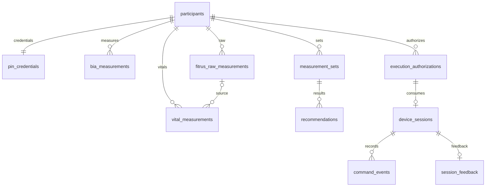

# 연결 계약: HTTP·데이터·내부 인터페이스

## 계약의 권위와 공통 규칙

[사실] `shared-contracts/openapi.yaml`은 공개 계약을 의도하지만 많은 request/response schema가 빠져 있다. 아래는 `backend-api/src/index.ts`의 실제 구현을 기준으로 복원했다. 응답 success/error는 대체로 JSON이고 공통 예외는500 `{error:'INTERNAL_ERROR'}`다. Hono의 미정의 경로404 등은 이 JSON 형식과 동일하다고 보장할 수 없다.

[사실] `/health`, `/v1/auth/pin`, `/v1/auth/refresh`를 제외한 경로는 `Authorization: Bearer <accessToken>`을 검증한다. 표에서 B는 이 인증을 뜻한다. 비밀키는 요청 본문에 넣지 않는다. API 공통 timeout/retry 미들웨어는 없다. Flutter는 connectTimeout10초만 설정하고 receive/send timeout·자동 재시도·401 자동갱신은 설정하지 않았다. FITRUS fetch는 optional signal을 받지만 호출 라우트는 signal을 주지 않는다.

## 전체 API

모든 구현 파일은 `backend-api/src/index.ts`이며 표의 경로가 라우트 식별자다. “호출”은 저장소 클라이언트 호출 존재 여부다. 서버 연결 경로의 실제 운영 호출을 관측했다는 뜻은 아니다.

| Method·Endpoint | 호출 주체·실제 호출 코드 | 요청 | 성공 응답 | 인증 | 주요 오류 |
|---|---|---|---|---|---|
| GET /health | BackendDeviceGateway.connect | 없음 | 200 `{ok:true,service:'vibecare-api',deviceMode}` | 없음 | DB 연결 검사 없이200; 물리장치 health 아님 |
| POST /v1/auth/pin | BackendAuthRepository.login | `{participantCode:string min1,pin:6자리숫자string}`. code trim/uppercase | 200 `{participant:{id,code,age,sex,heightCm},accessToken,refreshToken,expiresInSec:900}` | 없음 | 400 INVALID_REQUEST;503 AUTH_NOT_CONFIGURED;401 INVALID_CREDENTIALS;423 ACCOUNT_LOCKED+lockedUntil |
| POST /v1/auth/refresh | 앱 호출 없음 | `{refreshToken:string min20}` | 200 `{accessToken,expiresInSec:900}`. refresh 재발급 없음 | refresh 본문 | 400 INVALID_REQUEST(키 설정 오류도 포함);401 INVALID_REFRESH_TOKEN/REFRESH_TOKEN_REVOKED |
| GET /v1/algorithm-rules/current | BackendFitrusRepository.loadSnapshot | 없음 | 200 AlgorithmRuleSet 객체 | B | 401 UNAUTHORIZED;JSON/DB 오류500 |
| POST /v1/fitrus/measurements/:kind | 앱 호출 없음, 직접 API 가능 | kind enum6개; `{deviceId:string min1,measuredAt?:ISO datetime,payload:object}` | 201 `{requestId,rawMeasurementId,normalized:false,providerResponse}` | B | 400 INVALID_REQUEST;503 FITRUS_NOT_CONFIGURED;공급사 실패500 |
| GET /v1/participants/me/measurement-set/current | BackendFitrusRepository, deviceId query 전달 안 함 | `?deviceId=...` 선택. 없으면 본인 최근 기록의 기기 | 200 `{history:BiaDTO[],selectedMeasurementIds:string[],syncedAt:ISO}`. 이력20건 | B | 401;DB 오류500;데이터 없으면빈배열 |
| GET /v1/participants/me/vitals | BackendFitrusRepository | 없음 | 200 `{items:[{id,kind,measuredAt,values,units}]}` 최근50건 | B | 401;손상JSON/DB500 |
| POST /v1/recommendations/authorize | BackendDeviceGateway.authorize | `{measurementIds:string[4],safety:{acutePain,dizziness,clinicianHold},deviceId,algorithmVersion,requestedIntensityPct?:int1..100}` | 201 `{authorized:true,authorizationId,recommendationId,expiresAt,result}` 60초 유효 | B | 400 INVALID_REQUEST+details;404 PARTICIPANT_NOT_FOUND;409 MEASUREMENT_SET_STALE+currentMeasurementIds / ALGORITHM_VERSION_MISMATCH+currentRuleSet / INTENSITY_OUTSIDE_SAFE_RANGE+min/max;검토/차단은409 `{authorized:false,recommendationId,result}` |
| POST /v1/device-sessions | BackendDeviceGateway.start | `{authorizationId,deviceId}` + `Idempotency-Key` min16 | 새 요청201 `{sessionId,status:'RUNNING',mode:'mock',command}`;재요청200 `{sessionId,status,command}` | B | 400 IDEMPOTENCY_KEY_REQUIRED/INVALID_REQUEST;404 AUTHORIZATION_NOT_FOUND;409 AUTHORIZATION_ALREADY_USED/EXPIRED;501 DEVICE_PROTOCOL_NOT_CONFIGURED |
| POST /v1/device-sessions/:id/events | 앱 호출 없음 | `{eventType:ACK/RUNNING/STOPPING/COMPLETED/ERROR/DISCONNECTED,payload?:object}` 기본{} | 202 `{accepted:true}` | B·세션 소유자 | 400 INVALID_REQUEST;404 SESSION_NOT_FOUND;상태 변경 없음 |
| POST /v1/device-sessions/:id/stop | BackendDeviceGateway.stop | `{reason:string 길이1..100}` | 200 `{sessionId,status:'STOPPED',stoppedAt}` | B·세션 소유자 | 400 INVALID_REQUEST;404 SESSION_NOT_FOUND;물리ACK 없음 |
| POST /v1/session-feedback | 앱 호출 없음 | `{sessionId,rpe?:int0..10 또는null,pain?:int0..10 또는null,dizziness:boolean,discomfort?:string 최대500 또는null}` | 200 `{saved:true}` upsert | B·세션 소유자 | 400 INVALID_REQUEST;404 SESSION_NOT_FOUND;종료 여부 검사 없음 |

공통 B 경로는401 UNAUTHORIZED 가능하다. `POST /device-sessions`의 멱등 재응답 분기는 소유자 검사보다 먼저 실행되므로 위 B만으로 데이터 소유권이 보장되지 않는 예외다(I-01).

## 공급사 계약

| 내부 kind | FITRUS POST 경로 | 현재 역할 |
|---|---|---|
| bodyFat | /bodyfat | BIA 후보, 원본만 저장 |
| bloodPressure | /bp | 표시용 후보 |
| heartRate | /hr | 표시용 후보 |
| stress | /stress | 표시용 후보 |
| stressV2 | /stress2 | 표시용 후보, 최종 채택 미정 |
| bodyTemperature | /bodytemp | 표시용 후보 |

[사실] base=`https://api.thefitrus.com/fitrus-ml/measure`, 헤더 content-type application/json, x-api-key, 선택 x-request-id. 성공JSON을 object로 cast하며 필드·단위·confidence 검증 없음. upstream 오류는 FitrusApiError(status,responseBody). [확인 필요] 공급사 요청/응답 schema·제한·retry 정책. 기존 연결 기록은 `docs/evidence/fitrus-api-contract.md`; 이번에는 외부 호출하지 않았다.

## 엔티티·DB 계약

근거: `backend-api/migrations/0001_initial.sql`, `0002_measurements_and_rules.sql`. 아래에서 `!`는 NOT NULL 또는 PRIMARY KEY 필수, `?`는 nullable, PK/FK/UQ는 키 제약이다. SQL TEXT datetime은 `CURRENT_TIMESTAMP` 기본값과 ISO 문자열이 혼재한다. 표에 없는 DB 범위 검사는 구현됐다고 가정하지 않는다.

| 테이블 | 필드·타입·관계 | 생성/수정 주체 | 민감도·검증 |
|---|---|---|---|
| participants | id TEXT PK; participant_code TEXT! UQ; age INTEGER!; sex TEXT!; height_cm REAL!; created_at TEXT! default | 발급 API 없음, 수동/운영 절차 미정 | 참여자 가명·나이·성별·키. sex만 female/male CHECK; 나이·키 범위 DB검사 없음 |
| pin_credentials | participant_id TEXT PK/FK participants; salt TEXT!; pin_hash TEXT!; failed_attempts INTEGER! default0; locked_until TEXT?; refresh_version INTEGER! default0 | 초기 발급 없음; 로그인 실패수/잠금갱신 | 자격증명 해시·salt. PIN 원문 저장 안 함 |
| bia_measurements | id TEXT PK; participant_id TEXT! FK; device_id TEXT!; measured_at TEXT!; quality_passed INTEGER! CHECK0/1; weight_kg,bmi,body_fat_pct,fat_mass_kg,skeletal_muscle_mass_kg REAL!; raw_json TEXT!; created_at TEXT!; 아래7값 REAL? | 읽기만 구현. 공급사 정규화 INSERT 없음 | 건강정보. DB는 수치 상한·양수 검사 없음 |
| fitrus_raw_measurements | id TEXT PK; participant_id TEXT! FK; kind TEXT! enum6; source_device_id TEXT!; request_id TEXT! UQ; response_json TEXT!; measured_at TEXT!; created_at TEXT! | FITRUS proxy 성공 시 insert | 공급사 원본 전체, 개인정보 포함 가능 |
| vital_measurements | id TEXT PK; participant_id TEXT! FK; kind TEXT! enum5; measured_at TEXT!; values_json,units_json TEXT!; source_raw_id TEXT? FK; created_at TEXT! | 쓰기 경로 없음, 조회만 | 건강정보·종류별 단위 검증 없음 |
| algorithm_rule_sets | version TEXT PK; enabled INTEGER! CHECK0/1; active_from TEXT!; rules_json TEXT!; change_reason TEXT!; evidence_reference,approved_by TEXT?; created_at TEXT! | 0002 seed, 운영 갱신 API 없음 | 개인정보 아님(approved_by 식별자 가능). JSON runtime schema 없음 |
| measurement_sets | id TEXT PK; participant_id TEXT! FK; device_id TEXT!; measurement_ids_json,average_json,algorithm_version TEXT!; created_at TEXT! | authorize마다 insert | 선택 ID는 JSON, 각각 BIA FK 아님; 건강정보 |
| recommendations | id TEXT PK; participant_id TEXT! FK; measurement_set_id TEXT! FK; algorithm_version TEXT!; status TEXT! CHECK READY/REVIEW/BLOCKED; result_json TEXT!; created_at TEXT! | authorize마다 insert | 추천·경고 건강정보; rule version FK 없음 |
| execution_authorizations | id TEXT PK; participant_id TEXT! FK; device_id,algorithm_version,recommendation_json,expires_at TEXT!; used_at TEXT?; created_at TEXT! | authorize insert, start used_at update | 추천 원본JSON. recommendation_id FK 없음 |
| device_sessions | id TEXT PK; authorization_id TEXT! UQ/FK; idempotency_key TEXT! UQ; status TEXT!; started_at,stopped_at,stop_reason,command_json,completed_at TEXT? | start/stop | 건강행동 이력. status CHECK 없음; completed_at 미사용 |
| command_events | id TEXT PK; session_id TEXT! FK; event_type,payload_json TEXT!; created_at TEXT! | start/stop/events | payload에 민감정보 가능; 이벤트와 세션 상태 전이 미결합 |
| session_feedback | session_id TEXT PK/FK; rpe,pain INTEGER?; dizziness INTEGER! default0; discomfort TEXT?; created_at TEXT! | feedback upsert | 증상정보. API 범위검사, DB CHECK 없음; update시 created_at 유지 |

BIA 선택7항목은 basal_metabolic_rate_kcal, body_water_pct, protein_kg, mineral_kg, ecw_ratio, waist_cm, visceral_fat_level이다. 인덱스는 BIA(participant_id, measured_at DESC), raw/vitals(participant_id, kind, measured_at DESC). device_id를 포함한 인덱스는 없다.

다이어그램은 SQL FK 관계를 중심으로 표시한다. algorithmVersion·JSON 안의 measurementIds·recommendationId 사이의 논리 관계는 DB FK로 강제되지 않는다.

## 표준 DTO와 단위

[사실] BiaDTO는 `{id,participantId,deviceId,measuredAt,qualityPassed,values}`. values의 필수5항목은 weightKg(kg), bmi(kg/m² 의미), bodyFatPct(%), fatMassKg(kg), skeletalMuscleMassKg(kg). 나머지는 kcal/%/kg/ratio/cm/level을 이름과 UI에서 해석한다. 이는 **앱 표준 단위**이며 공급사 단위가 검증됐다는 뜻은 아니다.

[사실] AlgorithmRuleSet은 `{version,activeFrom,enabled,base:{durationSec,frequencyHz,intensityPct},age:{threshold,factor},sex:{femaleFactor,maleFactor},bodyFat:{female:{minimum,maximum},male:{minimum,maximum},outsideRangeFactor},output:{minimumPct,maximumPct}}`다. schema 자체도 minimum≤maximum 같은 관계 제약은 없다.

[사실] DeviceCommand는 `{authorizationId,participantId,deviceId,durationSec,frequencyHz,intensityPct,algorithmVersion,issuedAt,expiresAt,idempotencyKey}`. schema에는 선택 targetAccelerationG도 있으나 서버 명령은 생성하지 않는다. intensityPct는 기기 진폭·가속도 단위가 아니다.

## 내부 컴포넌트 계약

| 경계 | 인자 → 반환 | 상태·오류 |
|---|---|---|
| AuthRepository.login | participantCode, pin → Future<AuthSession> | participant/accessToken/refreshToken; Mock StateError 또는 DioException |
| SessionStore | save(session), readAccessToken(), clear() | Future<void/String?>; refresh read/restore API 없음 |
| FitrusRepository.loadSnapshot | participant, deviceId → Future<MeasurementSnapshot> | history, selected, vitals, syncedAt, ruleSet; Worker query에서 deviceId 무시 |
| calculateRecommendation(Dart) | profile, List<BiaMeasurement>, safety, ruleSet → AlgorithmResult | enum ready/review/blocked; 평균·warnings·adjustments·recommendation·measurementIds |
| calculateRecommendation(Worker) | AlgorithmInput → RecommendationResult | 문자열 READY/REVIEW/BLOCKED; average필수5만, factors, warnings; measurementIds 결과 없음 |
| calculateVibrationRecommendation(웹) | Profile(userId), flat measurement[], SafetyAnswers → AlgorithmResult | averagedValues12개, dataWarnings/safetyWarnings, adjustments.evidence, realDeviceSendAllowed:false |
| DeviceGateway | connect(deviceId), authorize(result,participant,safety,intensityPct), start(authorization), stop(sessionId,reason), dispose | Future·statusStream; 데이터 명령과 오류 상태 별도 전달 |
| PilotController→UI | PilotState | profile/snapshot/result/selectedIntensityPct/manual/pendingAuthorization/deviceState/session/remainingSec/isBusy/error; copyWith sentinel로 null과 미지정 구분 |

## 계약 충돌 목록

1. [사실] BIA API는 선택값을 null로 반환하지만 schema는 선택값이 존재할 경우 number만 허용한다. 필드 생략과 null의 차이(I-10).
2. [사실] vitals API에는 participantId가 없지만 vital schema는 필수다. 앱 모델도 participantId를 보유하지 않는다.
3. [사실] fatMassKg=0은 schema 통과 범위지만 세 엔진의 양수 검사는 거부한다. bodyFatPct>100은 schema는 거부하지만 서버 엔진은 유한양수 검사만 한다.
4. [사실] 웹 userId ↔ canonical participantId, averagedValues ↔ average, adjustments ↔ factors 등 같은 개념의 구조가 다르다. 직접 JSON 상호 교환은 불가능하다.
5. [사실] deviceId가 BIA 조회와 진동 허가에 동시에 쓰인다. Flutter는 고정 FITRUS-PLUS-01을 허가에 넣으면서 측정조회에는 전달하지 않는다.
6. [사실] Dart frequencyHz는 int, schema/Worker는 number. _parseRuleSet이 round하므로 소수Hz 규칙에서는 서버 비교 실패 가능.
7. [사실] plan의 모든 변경 요청 멱등키 규약과 달리 세션 시작만 요구한다. OpenAPI uniqueItems는 Zod 배열 단계에서 검증되지 않으며 후속 세트 검사로 거절될 수 있다.
8. [사실] BackendDeviceGateway의 “전송 완료”는 서버 허가를 받은 상태다. command_events COMPLETED는 DB session 완료로 이어지지 않고 /stop의 완료 reason도 status=STOPPED를 기록한다.

[추론] 표준DTO를 단일 생성 원천으로 삼고 요청·응답 양방향 schema 검증과 D1 adapter 테스트를 결합해야 언어간 drift를 줄일 수 있다.
