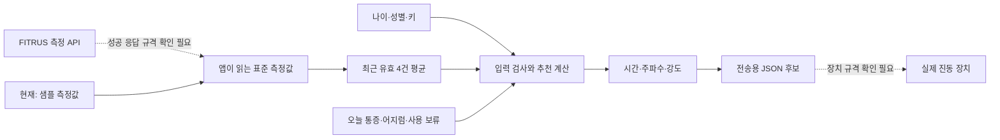

# 입력부터 출력까지 쉽게 보는 VibeCare

이 문서는 2026-09-07 인수 분석을 사용자 관점으로 풀어 쓴 설명이다. 아래의 개선안은 제안이며, 앱에 이미 반영됐다는 뜻은 아니다.

## 지금 어디까지 만들어졌나

**샘플 측정값으로 계산하고, 장치에 전달할 후보 데이터를 만드는 부분은 있다. 실제 FITRUS 측정값을 자동으로 받아 계산하는 연결과 실제 장치 전송은 아직 완성되지 않았다.**



## API URL은 무슨 뜻인가

URL은 요청을 보내는 주소이고, 끝부분은 요청하는 기능을 구분한다. 주소가 있다는 것과 올바른 입력을 넣어 실제 결과를 받았다는 것은 서로 다른 단계다.

FITRUS 공통 주소는 `https://api.thefitrus.com/fitrus-ml/measure`다. 뒤에 아래 경로가 붙는다. 모두 서버가 POST 요청으로 호출하도록 작성돼 있다.

| 주소 끝부분 | 쉬운 뜻 | 현재 앱에서의 역할 |
|---|---|---|
| /bodyfat | 체성분 측정 | 체중·BMI·체지방률·체지방량·골격근량 등을 받을 대상으로 계획. 실제 응답 필드 확인 필요 |
| /bp | 혈압 측정 | 표시용 후보. 추천 강도 계산에는 쓰지 않음 |
| /hr | 심박 측정 | 표시용 후보. 추천 강도 계산에는 쓰지 않음 |
| /stress | 스트레스 측정 | 표시용 후보 |
| /stress2 | 다른 스트레스 측정 경로 | stress와의 차이·채택 여부를 공급사에 확인해야 함 |
| /bodytemp | 온도 측정 | 표시용 후보. 체온/체표면 온도의 정확한 정의·단위 확인 필요 |

현재 앱의 시연 화면은 이 API에서 새로 받은 값 대신 코드에 들어 있는 샘플 값을 사용한다. 서버에 공급사 API를 호출하는 코드는 있지만, 성공 응답을 앱의 표준 측정값으로 바꾸는 기능은 없다.

앱 자체 서버의 주소는 별도다.

| 우리 서버 주소 | 쉬운 뜻 |
|---|---|
| /health | 서버가 응답하는지 확인. 실제 장치 연결 확인은 아님 |
| /v1/auth/pin | 참여자 코드와 PIN으로 로그인 |
| /v1/auth/refresh | 만료되는 로그인 권한 갱신. 현재 앱 자동 호출은 없음 |
| /v1/participants/me/measurement-set/current | 내 최근 측정값과 계산에 쓸 4개 ID 조회 |
| /v1/participants/me/vitals | 내 혈압·심박 등 보조 측정값 조회 |
| /v1/algorithm-rules/current | 현재 계산 규칙 조회 |
| /v1/fitrus/measurements/:kind | 우리 서버가 FITRUS에 측정 요청 전달 |
| /v1/recommendations/authorize | 서버가 다시 계산하고 실행 허가 발급 |
| /v1/device-sessions | 허가를 사용해 시연 실행 시작 |
| /v1/device-sessions/:id/events | 특정 실행의 상태 변화 기록 |
| /v1/device-sessions/:id/stop | 특정 실행의 중지 요청 |
| /v1/session-feedback | 실행 후 불편감·통증 등 저장. 앱 입력 화면은 아직 없음 |

`:kind`는 측정 종류, `:id`는 실행 기록의 식별자로 바뀌는 자리다. 공급사 인증키는 우리 서버에만 두도록 설계돼 있다.

## 입력값을 실제로 어떻게 쓰나

| 입력 | 계산에서의 역할 |
|---|---|
| 나이 | 70세 이상이면 강도에 0.90을 곱함 |
| 성별 | 여성은 0.95, 남성은 1.00을 곱함 |
| 체지방률 4건 평균 | 파일럿 참고범위 밖이면 0.90을 곱함 |
| BMI | 평균이 18.5 미만이면 검토 필요 상태로 전환 |
| 키·체중·체지방량 | 서로 계산상 맞는 측정인지 검사하는 데 사용. 서버 검사 일부 누락 |
| 골격근량 | 필수 데이터로 확인하고 평균·표시. 현재 강도를 직접 바꾸지는 않음 |
| 혈압·심박·스트레스·온도 | 상세 표시용. 현재 자동 강도 조절이나 증상 차단에 직접 사용하지 않음 |
| 통증·어지럼·사용 보류 | 해당하면 추천 실행 차단 |

예를 들어 현재 데모처럼 72세 여성이고 체지방 평균이 파일럿 참고범위보다 낮으면 다음과 같다.

`기본 50% × 연령 0.90 × 성별 0.95 × 체지방 0.90 = 38.475% → 38%`

시간은 5분, 주파수는 20Hz로 고정돼 있다. **계산식의 예제는 맞게 동작하지만, 이 계수가 사람에게 적절한지까지 검증된 것은 아니다.** 저장소도 이를 연구용 파일럿 규칙이라고 설명한다.

## 출력은 보낼 수 있는 형태인가

현재는 시간·주파수·강도와 참여자·기기·규칙 버전·허가 만료시간 등을 묶는 구조가 있다. 핵심 값만 간추리면 다음과 같다.

```json
{
  "durationSec": 300,
  "frequencyHz": 20,
  "intensityPct": 38,
  "algorithmVersion": "pilot-0.3.0"
}
```

이 예시는 전체 전송 명령이 아니라 이해를 위한 일부 필드다. 실제 내부 명령에는 authorizationId, participantId, deviceId, issuedAt, expiresAt, idempotencyKey도 포함된다.

**우리 프로그램 안에서 데이터를 전달할 준비는 부분적으로 되어 있지만, 실제 장치가 받아들이는 명령이라고 확정할 수는 없다.** 장치가 JSON을 받는지, Bluetooth 바이트 명령을 받는지, 38%가 어떤 진폭·가속도인지, 정상 수신·중지 응답이 무엇인지 아직 확인되지 않았다.

## 지금 품질에서 보완할 부분

| 확인할 질문 | 현재 평가 | 필요한 개선 |
|---|---|---|
| 실제 API 값인가? | 기본 실행은 샘플 | 화면에 샘플/실측 구분, 공급사 응답 변환 구현 |
| 올바른 4건을 골랐나? | 기본 예제는 가능, 일부 조회 오류 있음 | 같은 사용자·측정기·유효값·최근순 기준 통일 |
| 계산을 믿을 수 있나? | 수식 예제 통과, 앱/서버 검사가 다름 | 잘못된 값·누락·중복·범위 밖 사례까지 동일하게 검사 |
| 안전 질문을 확인했나? | 앱은 미응답도 증상 없음 처리 | 예/아니요를 명시적으로 답하기 전 실행 차단 |
| 전송 데이터가 맞나? | 내부 구조 있음, 일부 데이터 계약 불일치 | 값·단위·필수항목·기기ID 구분과 JSON 검증 |
| 중복 시작·중지가 안전한가? | 권한·중복·중지 실패 복구 문제 있음 | 서버 권한과 실행 상태 수정, 중지 실패에도 재중지 제공 |
| 한 화면에서 이해되나? | 작은 화면 깨짐 검사만 통과 | 중요한 값과 상태를 먼저 배치하고 사용자 과업으로 확인 |

## 첫 화면 개선안

모든 원본 측정값을 작게 눌러 넣기보다, 사용자가 바로 판단할 정보를 한 화면에 둔다.

1. **누구의 어떤 데이터인가:** 참여자, 샘플/실측, 마지막 측정 시각, 사용한 4건.
2. **계산에 쓰인 값:** 나이·성별·평균 체지방, 필요하면 평균 BMI와 검토 사유.
3. **결과:** 강도 38%, 5분, 20Hz와 간단한 보정식.
4. **오늘 상태 확인:** 통증·어지럼·보류를 명시적으로 응답. 미확인 상태를 숨기지 않음.
5. **다음 행동:** 준비 전에는 이유, 준비되면 시연 명령 준비, 실행 중에는 중지 버튼.

원본 4건 전체, 보조 생체신호, 자세한 보정 이유, 개발용 JSON은 상세 화면으로 보낸다. 일반 사용자의 첫 화면에 API URL이나 JSON을 펼쳐 놓을 필요는 없다.

품질 확인은 다음 기준으로 한다: 작은 화면에서 핵심 결과와 행동 버튼이 보일 것, 큰 글자에서도 잘리지 않을 것, 샘플을 실측으로 오해하지 않을 것, 문진 미응답에서는 시작할 수 없을 것, 오류가 나면 다음 행동이 보일 것. 현재 이 전체 기준을 통과했다고 확인한 상태는 아니다.

근거: `backend-api/src/fitrus-client.ts`, `backend-api/src/index.ts`, 세 알고리즘 구현, Flutter controller/화면/테스트, `shared-contracts/`, 기존 인수 분석. 구체적인 코드 문제와 재현은 `08_VERIFICATION.md`에 기록했다.
