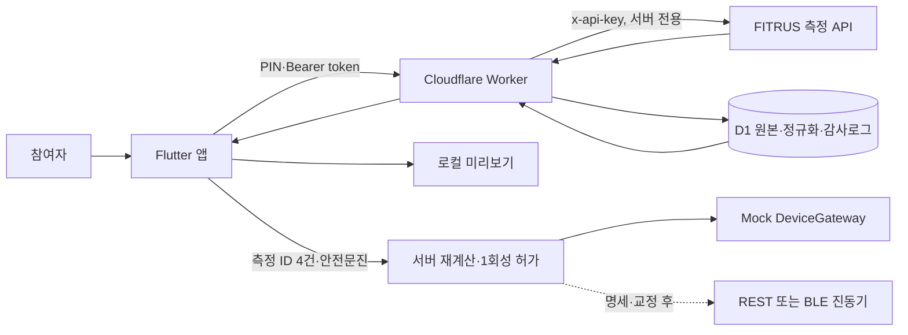
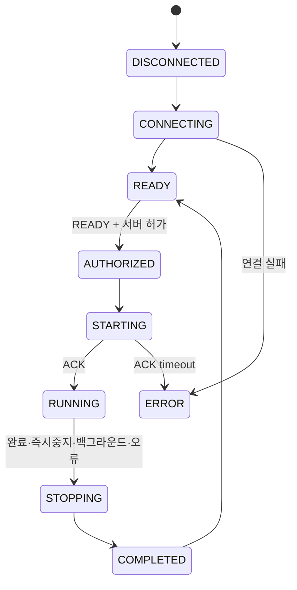

# VibeCare Flutter 시스템 설계

이 문서는 구현 기준을 요약한다. 상세 유스케이스와 상태도는 `architecture.md`, 공개 HTTP 계약은 `../packages/contracts/openapi.yaml`을 단일 기준으로 사용한다. 기존 React PWA는 비교·검증용이며 주 클라이언트는 Flutter다.

## 전체 흐름

## 책임 경계

| 계층 | 책임 | 금지사항 |
|---|---|---|
| Flutter | 입력·원본·평균·보정식 표시, 안전 문진, 로컬 미리보기, 기기 상태 UI | FITRUS API 키 저장, REVIEW/BLOCKED 우회 |
| Worker | PIN 잠금, 본인 데이터 권한, FITRUS 프록시, 최신 4건, authoritative 계산, 1회성 허가, 세션 로그 | 공급사 미확인 필드 임의 해석 |
| D1 | 원본 응답, canonical 측정, 규칙 버전, 추천, 명령·피드백 감사 이력 | PIN 원문과 공급사 API 키 저장 |
| DeviceGateway | connect/authorize/start/stop/status 추상화 | 교정되지 않은 실출력 |

## 측정 선택과 계산

1. 토큰의 참여자 ID와 현재 소스 기기가 일치하는 기록만 남긴다.
2. 품질 실패, 필수값 오류, 중복 ID를 제외하고 측정시각 내림차순으로 네 건을 고른다.
3. 체중·BMI·체지방률·체지방량·골격근량은 필수이며 네 값의 산술평균을 계산한다.
4. 기초대사량·체수분·단백질·무기질·세포외수분비·복부둘레·내장지방은 네 값이 모두 있을 때 평균하고, 아니면 `계산 불가`로 표시한다.
5. 혈압·심박·스트레스·스트레스2·체온은 1차 버전에서 저장·표시만 한다.
6. Flutter 계산은 미리보기다. 실제 실행 허가는 Worker가 D1 원본과 현재 규칙으로 다시 계산한다.

## 실행 상태

Mock은 같은 상태와 명령 계약을 사용하지만 실제 출력이 없다. 실제 REST/BLE 구현은 기기 명세, ACK 제한시간, 중지 명령, Hz·강도와 물리 진폭/가속도 매핑이 검증된 뒤에만 추가한다.

## 구현 완료와 외부 차단

- 구현됨: Mock 로그인·데이터 repository·최근 4건·전체 값 화면·보정식·Mock 실행·중지, Worker 인증·조회·추천·Mock 세션 API, D1 확장 스키마.
- 검증 대기: Flutter analyze/test/APK, D1 로컬 통합 테스트, 앱과 Worker 실제 HTTP 연결.
- 외부 차단: FITRUS 요청/응답 예제 기반 정규화, 실제 진동기 프로토콜과 교정값.
